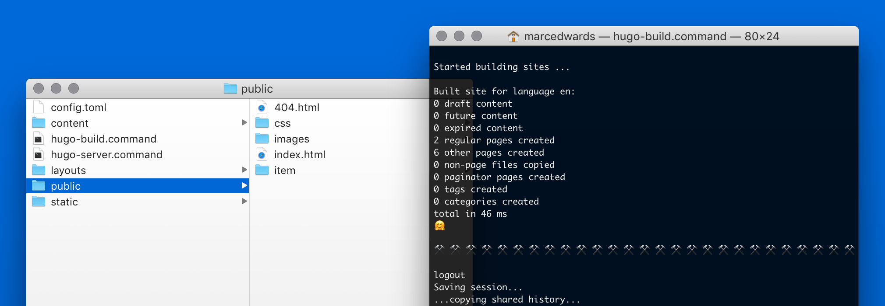

# Hugs

[Hugs](https://bjango.com/designresources/) is a super simple starting point for [Hugo](http://gohugo.io) websites.

Hugs is an entire starting point for Hugo projects, where the intention is to build a custom design. It contains no CSS, and only a tiny bit of HTML. However, it does include a fully set up folder structure, config.toml, partials, basic HTML templates, basic Markdown example posts, and scripts to build and run Hugo’s server.

Hugs is what I use for all new website projects that I am building using Hugo, and I thought others may benefit from a good starting point. It took me a while to parse all the Hugo documentation initially, and I think this would have helped me.

🤗

Hugs is free and open source, released under the [BSD license](https://github.com/bjango/Hugs/blob/master/Help/License.md).

**Download:** **[Hugs](https://github.com/bjango/Hugs/archive/master.zip)** — 1.0 ([version history](https://github.com/bjango/Hugs/blob/master/Help/Version%20History.md))

```
              :::::::::     :::::::       ::::        ::::    :::     ::::::::      :::::::: 
             :+:    :+:        :+:      :+: :+:      :+:+:   :+:    :+:    :+:    :+:    :+: 
            +:+    +:+        +:+     +:+   +:+     :+:+:+  +:+    +:+           +:+    +:+  
           +#++:++#+         +#+    +#++:++#++:    +#+ +:+ +#+    :#:           +#+    +:+   
          +#+    +#+        +#+    +#+     +#+    +#+  +#+#+#    +#+   +#+#    +#+    +#+    
         #+#    #+#    #+# #+#    #+#     #+#    #+#   #+#+#    #+#    #+#    #+#    #+#     
        #########      #####     ###     ###    ###    ####     ########      ######## 
```